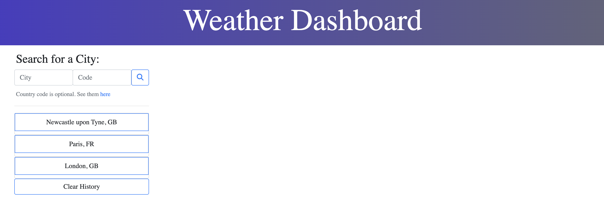
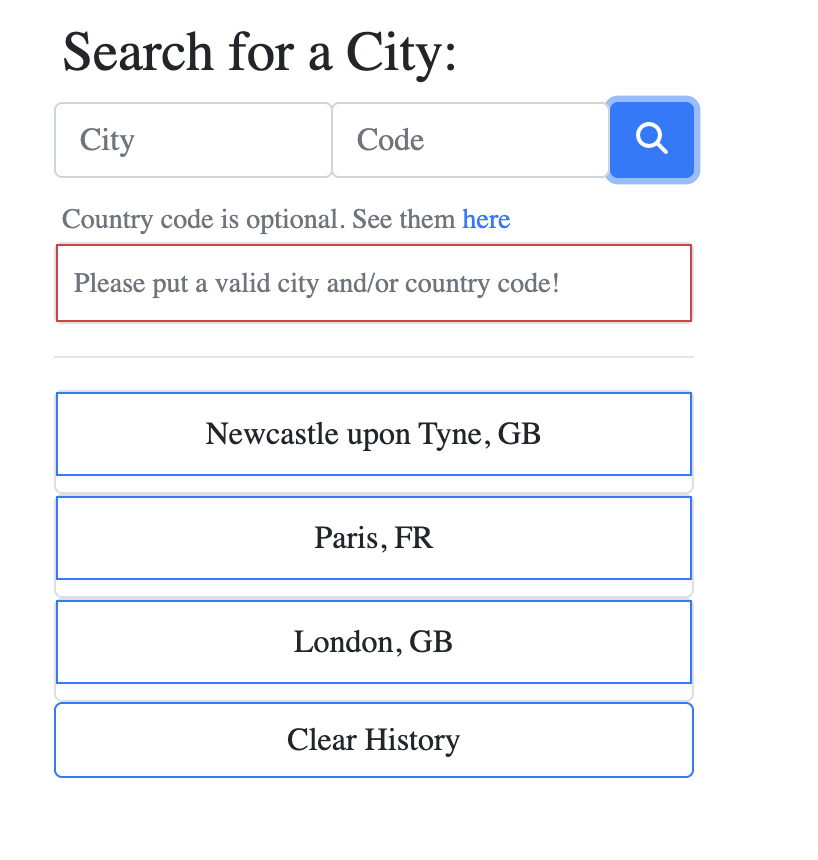
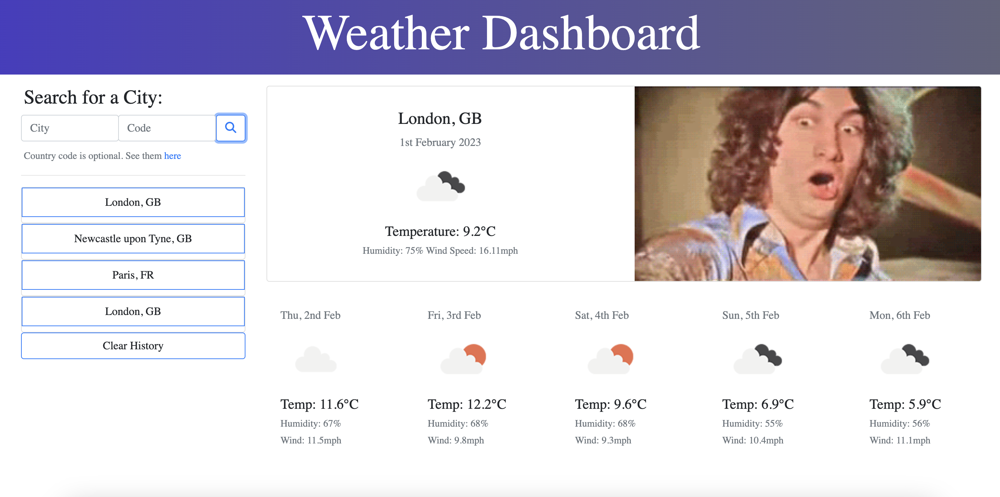

# Weather Forecast Dashboard

## Description

URL to deployed application: https://cedekpoole.github.io/weather-dashboard/

### Technologies used: 
- HTML, CSS
- Bootstrap (v4.6)
- JavaScript
- jQuery (v3.6.3)
- Moment.js
- OpenWeather API
- Giphy API 

### New Skills Practiced: 
- jQuery, Moment.js and Bootstrap => This project gave me another opportunity to further practice these skills. After completion of this dashboard app, I feel confident in applying these technologies to other projects in the foreseeable future. Even though there are arguments about whether jQuery remains relevant in 2023, it still persists in being the most-used JavaScript library on the web. With that being the case, having a good grasp of it is essential on this journey. 
- Server-side APIs => OpenWeather API was the primary server-side API employed in the creation of this project. OpenWeather provide numerous APIs that concern the weather, ranging from providing historical weather data to forecasting weather data for the next 30 days for a specified location. For the weather dashboard application, I used the '[Current Weather Data](https://openweathermap.org/current)' and the '[5 Day/ 3 Hour Forecast](https://openweathermap.org/forecast5)' API. In addition to OpenWeather, I also extracted gif data from the [Giphy API](https://developers.giphy.com/docs/api/#quick-start-guide), creating code that randomly picked a gif to play when the current weather forecast is displayed. This project endowed me with a deeper understanding of the function and relationship between server-side APIs and web pages. 
- AJAX requests => In order to get this information from these server-side APIs, I sent AJAX (Asynchronous Javascript and XML) requests which allow developers to make asynchronous HTTP requests from JavaScript without triggering a refresh of the entire webpage. I implemented Ajax in jQuery using the $.ajax method which allowed me to retrieve information in JSON (JavaScript Object Notation) format. In the future, I aim to learn fetch API (which was introduced in JSE6) to make AJAX calls in JavaScript.

Essentially, the Weather Dashboard application was used as means to practice the above technologies and skills. As a result of this endeavour, I have created a functional webpage that displays the current and forecasted weather of any city the user has provided. The user can see the weather outlook for multiple cities, and by using this app, they are able to plan a trip accordingly. 

### Acceptance Criteria
- Create a weather dashboard with form inputs.
- When a user searches for a city they are presented with current and future conditions for that city and that city is added to the search history.
- When a user views the current weather conditions for that city they are presented with:

    - The city name

    - The date

    - An icon representation of weather conditions

    - The temperature

    - The humidity

    - The wind speed
- When a user views future weather conditions for that city they are presented with a 5-day forecast that displays:

    - The date

    - An icon representation of weather conditions

    - The temperature

    - The humidity
- When a user clicks on a city in the search history they are again presented with current and future conditions for that city.

## Installation 

N/A

## Usage

When you first open the [page](https://cedekpoole.github.io/weather-dashboard/), you are welcomed to a form where the user can type in a city name and an optional country code. In the article on the left hand side, previous searches are stored (via local storage) for easier access to the weather in previously searched cities. By pressing the 'Clear History' button, you remove the data from local storage and the previous searches disappear. 

If the user submits incorrect data when they search for a city, a temporary pop up reveals itself, prompting the user to try again. This happens when the ajax request fails (due to the invalid query search).

When the user searches for a valid city and country code, the current weather and the five day forecast for that destination will be displayed. A random gif will also be rendered next to the current weather data to brighten up the user's day! 

## Roadmap

To further improve the functionality of this weather dashboard application, I would like the forecast to range from 10 days instead of 5. In addition to this, I would like to use the Google Places API to provide a random photograph of the specific location picked by the user. If you have any other ideas on how to improve this page (and ways to go about it), please share them!

## License 

Please refer to the LICENSE in the repo. 